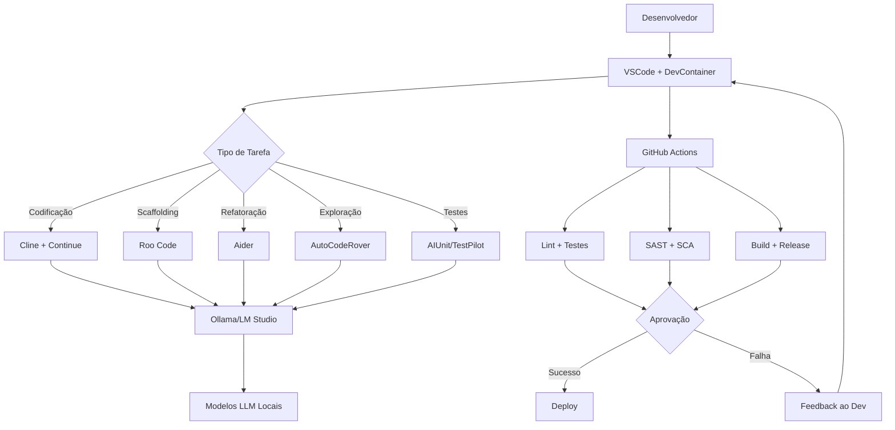

# AI-Assisted Development Stack - Solution Design Canvas

## Visão Geral

Este documento apresenta a solução de desenvolvimento assistido por IA utilizando o método **Solution Design Canvas (SDC)**. A stack descrita oferece um ambiente completo e automatizado para desenvolvimento com assistência de IA, focado em privacidade, segurança, autonomia e produtividade.

---

> 🔗 **Link para o SDC no Miro**: [Visualizar Solution Design Canvas interativo](https://github.com/devopsvanilla/AtlasStack/blob/main/AI-sdc.md)

### 📦 Independência e Modularidade

**Esta stack pode ser utilizada de forma independente**, sem depender das demais funcionalidades do AtlasStack. Sob o ponto de vista de produto, esta é uma **feature autônoma** que pode ser:

- ✅ Adotada isoladamente por equipes e projetos
- ✅ Integrada a outras plataformas e workflows existentes
- ✅ Customizada conforme necessidades específicas
- ✅ Implantada em qualquer ambiente (local, cloud, híbrido)
- ✅ Evoluída independentemente de outras features do AtlasStack

Esta modularidade garante **flexibilidade máxima** para diferentes contextos de uso, desde desenvolvedores individuais até grandes organizações.

## 1. PROBLEMA E OPORTUNIDADE

### Contexto

Equipes de desenvolvimento modernas enfrentam desafios crescentes:

- **Complexidade tecnológica**: Proliferação de ferramentas, frameworks e linguagens
- **Velocidade de entrega**: Pressão por ciclos de desenvolvimento cada vez mais curtos
- **Qualidade e segurança**: Necessidade de código seguro, testável e mantenível
- **Custos com ferramentas comerciais**: Dependência de soluções proprietárias caras
- **Privacidade de dados**: Preocupações com código sensível sendo enviado para nuvens externas
- **Configuração de ambientes**: Tempo gasto configurando ambientes de desenvolvimento

### Oportunidade

Criar uma **stack open source** que combine:

- IA local para assistência de codificação sem comprometer privacidade
- Ambientes reproduzíveis e isolados
- Esteira DevSecOps automatizada
- Orquestração inteligente de agentes de IA
- Custo zero e flexibilidade máxima

---

## 2. PÚBLICO-ALVO

### Perfil de Usuários

**Desenvolvedores Individuais**
- Buscam produtividade e assistência inteligente
- Valorizam privacidade e autonomia
- Querem ambiente pronto sem configuração complexa

**Equipes de Desenvolvimento**
- Precisam de ambientes padronizados e reproduzíveis
- Requerem esteira CI/CD com segurança integrada
- Desejam reduzir custos com ferramentas proprietárias
- Desejam reduzir custos com ferramentas proprietárias

**Equipes de Operações de TI**

- Precisam de ferramentas para gestão e monitoramento de infraestrutura
- Buscam automação para reduzir tarefas repetitivas e erros humanos
- Requerem visibilidade e observabilidade de sistemas em produção
- Valorizam praticas SRE e DevOps para melhorar confiabilidade
- Desejam integração com pipelines CI/CD e GitOps

**Projetos Open Source**
- Necessitam de transparência e auditabilidade
- Buscam independência tecnológica
- Valorizam soluções comunitárias

**Empresas com Requisitos de Conformidade**
- Preocupações com segurança de propriedade intelectual
- Necessidade de dados confidenciais não saírem do ambiente controlado
- Requisitos regulatórios (LGPD, GDPR, etc.)

---

## 3. PROPOSTA DE VALOR

### O que esta stack entrega

🧠 **Assistência de Codificação com IA Local**
- Modelos LLM como DeepSeek, Qwen2 e Mistral rodando via Ollama
- Privacidade total: nenhum dado sai do ambiente local
- Flexibilidade para escolher e personalizar modelos

📦 **Ambiente Isolado e Reproduzível**
- DevContainers e GitHub Codespaces
- Qualquer desenvolvedor inicia com ambiente pronto
- Consistência entre ambientes de desenvolvimento, teste e produção

🛡️ **Esteira DevSecOps Automatizada**
- GitHub Actions + validações locais com Act
- Lint, testes, SAST, SCA automáticos
- Qualidade e segurança antes do versionamento

🤖 **Orquestração Inteligente de Agentes**
- Cline, Roo Code, Continue, Jan, Aider
- Agentes trabalham juntos para estruturar, refatorar e testar código
- Autonomia e inteligência na geração de código

🚀 **Pronto para Uso como Template**
- Basta clonar ou usar como base para novos projetos
- Tudo já configurado e documentado
- Aceleração no início de projetos

### Vantagens Frente a Soluções Comerciais

✅ **Privacidade Total**
- Sem dependência de nuvem externa
- Sem envio de dados para terceiros
- Controle completo sobre propriedade intelectual

💰 **Custo Zero**
- Todas as ferramentas são open source
- Funciona localmente
- Sem licenças ou assinaturas mensais

🔧 **Flexibilidade Máxima**
- Escolha de modelos de IA
- Ajuste de fluxos e pipelines
- Personalização de agentes

🎓 **Independência Tecnológica**
- Sem bloqueios por licenças
- Sem integrações proprietárias
- Sem limitações de uso

---

## 4. ARQUITETURA DA SOLUÇÃO

### Componentes da Stack

| Camada | Ferramenta | Finalidade Principal |
|--------|-----------|---------------------|
| **IDE** | VSCode | Ambiente de desenvolvimento principal, extensível e compatível com DevContainers e IA |
| **Agente Central** | Cline | Coordenação de tarefas com IA, geração de código, refatoração, testes e planejamento |
| **Sugestões** | Continue | Autocompletar inteligente e sugestões contextuais enquanto você digita |
| **Estruturação** | Roo Code | Geração de múltiplos arquivos, organização de projetos e scaffolding com IA |
| **Execução Local** | Ollama / LM Studio | Backend local de modelos LLM (DeepSeek, Qwen2, Mistral) com privacidade e autonomia |
| **Orquestração** | Jan | Planejamento de tarefas complexas com agentes especializados e memória persistente |
| **Refinamento** | Aider | Refatoração de código com IA, sincronização automática e explicações técnicas |
| **Exploração** | AutoCodeRover | Navegação e explicação de bases de código grandes ou legadas com IA |
| **Testes** | AIUnit / TestPilot | Geração automatizada de testes unitários e de integração com IA |
| **Ambiente Isolado** | DevContainers | Ambientes reproduzíveis e isolados para desenvolvimento, testes e CI/CD |
| **CI/CD Remoto** | GitHub Codespaces | Ambientes de desenvolvimento na nuvem com DevContainers e integração total ao GitHub |
| **Esteira DevSecOps** | GitHub Actions + Act | Workflows automatizados para lint, testes, SAST, SCA, releases e validações locais |
| **Segurança** | OpenSSF Best Practices | Conjunto de práticas para repositórios seguros, incluindo Scorecard, Allstar e scanning |

### Fluxo de Trabalho



---

## 5. CASOS DE USO

### Caso de Uso 1: Desenvolvimento de Novo Projeto

**Cenário**: Desenvolvedor inicia um projeto Python do zero

**Fluxo**:
1. Clona o repositório template AtlasStack
2. Abre no VSCode com DevContainer
3. Usa Roo Code para gerar estrutura inicial (pastas, arquivos, testes)
4. Cline auxilia na implementação de features
5. Continue oferece autocompletar contextual
6. AIUnit gera testes automaticamente
7. Commit dispara GitHub Actions
8. Validações automáticas (lint, testes, SAST, SCA)
9. Aprovação e merge

**Benefícios**:
- Setup instantâneo (< 5 minutos)
- Código com qualidade desde o início
- Testes automatizados
- Segurança garantida

### Caso de Uso 2: Refatoração de Código Legado

**Cenário**: Equipe precisa modernizar aplicação antiga

**Fluxo**:
1. Importa código legado para o ambiente
2. AutoCodeRover analisa e mapeia a base de código
3. Aider sugere refatorações e melhorias
4. Desenvolvedor aprova e aplica mudanças
5. AIUnit gera testes para cobrir código refatorado
6. Pipeline valida mudanças
7. Deploy gradual (canary/blue-green)

**Benefícios**:
- Compreensão rápida de código complexo
- Refatoração assistida por IA
- Cobertura de testes automatizada
- Risco reduzido

### Caso de Uso 3: Desenvolvimento Distribuído

**Cenário**: Equipe global trabalhando em horrios diferentes

**Fluxo**:
1. Todos usam mesmo DevContainer (consistência)
2. GitHub Codespaces para desenvolvedores remotos
3. Jan orquestra tarefas complexas com memória persistente
4. Workflows automatizados garantem integração contínua
5. Act valida localmente antes de push

**Benefícios**:
- Ambiente idêntico para todos
- Desenvolvimento em qualquer lugar
- Integração contínua sem atrito
- Feedback rápido

### Caso de Uso 4: Gestão de Infraestrutura com GitOps

**Cenário**: Equipe de Operações de TI gerenciando infraestrutura de produção

**Fluxo**:

1. Repositório Git como fonte única da verdade para configurações
2. Declarações de infraestrutura como código (IaC)
3. Pipelines automatizados aplicam mudanças via pull requests
4. Monitoramento contínuo com Prometheus e Grafana
5. Alertas automáticos via inteligencia de IA
6. Reversões instantâneas via rollback de commits
7. Audit trail completo de todas as mudanças

**Benefícios**:

- Gestão declarativa e versionada de infraestrutura
- Rastreabilidade completa de mudanças
- Recuperação rápida de desastres
- Conformidade e auditoria simplificadas
- Redução de erros de configuração manual

---

## 6. REQUISITOS E RESTRIÇÕES

### Requisitos Técnicos

**Hardware Mínimo**:
- CPU: 4 cores (8+ recomendado para modelos LLM maiores)
- RAM: 16 GB (32 GB recomendado)
- Disco: 50 GB livres (SSDs recomendados)
- GPU: Opcional, mas acelera inferência de modelos

**Software**:
- Docker Desktop ou Engine
- VSCode
- Git
- Acesso ao GitHub (para Actions e Codespaces)

**Conectividade**:
- Internet para download inicial de modelos e imagens
- Opção de funcionar 100% offline após setup

### Restrições

**Performance**:
- Modelos LLM grandes exigem hardware robusto
- Primeira execução pode ser lenta (download de imagens)

**Compatibilidade**:
- Requer sistema operacional com suporte a containers (Linux, macOS, Windows com WSL2)
- Algumas ferramentas podem ter limitações em arquiteturas ARM

**Aprendizado**:
- Curva de aprendizado inicial para configurar agentes
- Documentação extensa fornecida para facilitar

---

## 7. METODOLOGIAS E COMITÊS DE PRÁTICA

Esta solução adota as metodologias descritas em [METHODOLOGIES.md](./METHODOLOGIES.md), que servem como base para os comitês de prática do projeto:

### Solution Design Canvas
- Estruturação colaborativa de soluções
- Alinhamento entre negócio e tecnologia
- Documentação visual de decisões arquiteturais

### Technology Radar
- Avaliação contínua de ferramentas e tecnologias
- Decisões baseadas em maturidade e adequação
- Orientação para adoção de novas ferramentas de IA

### Day 0/1/2 Operations
- **Day 0**: Design da stack, seleção de ferramentas, planejamento de integrações
- **Day 1**: Setup de DevContainers, configuração de workflows, implantação inicial
- **Day 2**: Manutenção de modelos, atualizações de ferramentas, otimização de pipelines

### DevSecOps
- Segurança integrada desde o design
- SAST, SCA e testes automáticos
- OpenSSF Best Practices aplicadas

### SRE (Site Reliability Engineering)
- SLIs/SLOs para pipelines de CI/CD
- Observabilidade de workflows
- Automação de tarefas operacionais (toil reduction)

### Developer Experience (DX)
- Ambiente pronto em minutos
- Documentação clara e acessível
- Feedback rápido via Act (validações locais)
- Portal de auto-serviço para operações comuns

### Comitês de Prática

As metodologias acima formam a base para os seguintes comitês:

1. **Comitê de Arquitetura**: Aplica SDC e Technology Radar
2. **Comitê de Segurança**: Implementa DevSecOps e OpenSSF
3. **Comitê de Operações**: Garante SRE e Day 0/1/2 practices
4. **Comitê de Experiência do Desenvolvedor**: Foca em DX

---

## 8. ROADMAP E EVOLUÇÃO

### Fase 1: Foundation (Atual)

✅ Stack completa funcional
✅ DevContainers configurados
✅ Workflows básicos de CI/CD
✅ Integração com modelos LLM locais

### Fase 2: Enhancement (Próximos 3-6 meses)

🚧 Adicionar mais agentes especializados
🚧 Melhorar orquestração com Jan
🚧 Expandir workflows com mais tipos de validações
🚧 Documentar receitas e padrões de uso
🚧 Criar biblioteca de prompts otimizados

### Fase 3: Scale (6-12 meses)

💭 Suporte multi-linguagem (Java, Go, Rust, etc.)
💭 Integração com mais plataformas de IA
💭 Templates específicos por tipo de projeto
💭 Metrics e dashboards de produtividade

### Fase 4: Ecosystem (12+ meses)

🔮 Marketplace de agentes personalizados
🔮 Plugins da comunidade
🔮 Certificações e treinamentos
🔮 Integração com IDEs adicionais (IntelliJ, Vim, etc.)

---

## 9. MÉTRICAS DE SUCESSO

### Indicadores de Adoção

## 9. OPEN SOURCE, PARCERIAS E ECOSSISTEMA

### Filosofia Open Source

Esta solução adota **código aberto (OSS)** como princípio fundamental, promovendo:

🌐 **Transparência Total**
- Código-fonte acessível e auditável
- Documentação pública e colaborativa
- Processos de desenvolvimento visíveis
- Roadmap compartilhado com a comunidade

🤝 **Colaboração Aberta**
- Contribuições bem-vindas de toda a comunidade
- Governança participativa e democrática
- Decisões técnicas baseadas em mérito
- Reconhecimento de contribuidores

🛡️ **Sustentabilidade**
- Modelo de desenvolvimento sustentável
- Múltiplas organizações e indivíduos envolvidos
- Independência de fornecedores únicos
- Longevidade garantida pela comunidade

### Estratégia de Parcerias

#### 1. Parcerias com Mantenedores de Ferramentas OSS

**Objetivos**:
- Colaborar ativamente com projetos upstream (Ollama, Cline, Continue, etc.)
- Contribuir com melhorias, bug fixes e features
- Participar de discussões de roadmap e arquitetura
- Garantir compatibilidade e integração suave

**Benefícios Mútuos**:
- **Para os projetos OSS**: Feedback real, casos de uso, contribuições de código, amplificação de visibilidade
- **Para o AtlasStack**: Acesso antecipado a features, suporte prioritário, influência em roadmaps

**Exemplos de Parcerias Desejadas**:
- Ollama: Otimizações de performance, novos modelos
- Cline: Integrações avançadas, workflows customizados
- Continue: Melhorias de autocompletar, suporte multi-linguagem
- Aider: Refatorações inteligentes, padrões de projeto

#### 2. Comunidades de Prática

**Participação Ativa em**:

👥 **Comunidades Técnicas**:
- DevOps communities (DevOps Institute, CNCF, Linux Foundation)
- AI/ML communities (Hugging Face, OpenAI Community, LangChain)
- Developer Experience communities (DX, Platform Engineering)

🏛️ **Fóruns e Eventos**:
- Conferências (KubeCon, DevOpsDays, AI Summit)
- Meetups locais e virtuais
- Hackathons e code sprints
- Webinars e workshops

📝 **Contribuições**:
- Apresentações técnicas
- Artigos e tutoriais
- Código e ferramentas open source
- Mentoria e advocacy

#### 3. Instituições e Fundações

**Alinhamento com**:

🌟 **OpenSSF (Open Source Security Foundation)**
- Adoção de best practices de segurança
- Participação em working groups
- Certificação OpenSSF Scorecard

📚 **DevOps Institute**
- Alinhamento com certificações (SRE Foundation, DevSecOps, etc.)
- Participação em grupos de estudo
- Contribuições para SKILup programa

🤖 **AI Foundations**
- Partnership for AI
- OpenAI Community
- Hugging Face Partnerships
- LangChain Ecosystem

⚙️ **CNCF (Cloud Native Computing Foundation)**
- Alinhamento com projetos cloud-native
- Contribuições para Kubernetes, Prometheus, etc.
- Participação em SIGs relevantes

🌐 **Linux Foundation**
- Suporte a projetos LF
- Participação em iniciativas open source
- Alinhamento com padrões e melhores práticas

### Oportunidades Comerciais e Fomento

Apesar da filosofia open source, reconhecemos oportunidades de **sustentabilidade comercial** e **fomento do ecossistema**:

#### Modelos de Valor Comercial

💼 **Serviços Profissionais**:
- **Consultoria**: Implementação, customização, otimização
- **Treinamento**: Workshops, certificações, bootcamps
- **Suporte Enterprise**: SLAs, suporte 24/7, hotfixes prioritários
- **Integrações Customizadas**: Desenvolvimento sob demanda

🏫 **Educação e Certificação**:
- **Cursos Online**: Plataformas de e-learning
- **Certificações**: Validação de competências
- **Bootcamps**: Programas intensivos
- **Treinamentos Corporativos**: In-company e remotos

🛠️ **Ofertas Managed/Hosted**:
- **Cloud Hosting**: Versão gerenciada da stack
- **Private Cloud**: Implantações dedicadas
- **SaaS Add-ons**: Features premium opcionais
- **Marketplace de Extensões**: Plugins e integrações comerciais

👥 **Parcerias Comerciais Estratégicas**:
- **Cloud Providers**: Marketplaces (AWS, Azure, GCP)
- **Plataformas de DevTools**: Integrações e co-marketing
- **Vendors de IA**: Parcerias com fornecedores de modelos LLM
- **Enterprise Vendors**: Integrações com ferramentas empresariais

#### Fomento do Ecossistema

🌱 **Investimento em Comunidade**:
- **Grants e Bolsas**: Financiamento para contribuidores
- **Hackathons e Bounties**: Incentivar desenvolvimento
- **Programas de Mentoria**: Formar novos contribuidores
- **Conferências e Eventos**: Patrocinar e organizar

📚 **Produção de Conteúdo**:
- **Blogs e Artigos Técnicos**: Compartilhar conhecimento
- **Vídeos e Tutoriais**: Facilitar aprendizado
- **Livros e E-books**: Documentação profunda
- **Podcasts e Webinars**: Discussões e entrevistas

🔬 **Pesquisa e Inovação**:
- **Parcerias Acadêmicas**: Colaboração com universidades
- **Laboratórios de Inovação**: Experimentar novas tecnologias
- **Publicações Científicas**: Contribuir para o estado da arte
- **Open Innovation**: Colaborar com startups e pesquisadores

### Governança e Sustentabilidade

#### Modelo de Governança

🏛️ **Estrutura**:
- **Technical Steering Committee (TSC)**: Decisões técnicas estratégicas
- **Working Groups**: Áreas específicas (Segurança, IA, DevSecOps, etc.)
- **Maintainers**: Responsáveis por componentes específicos
- **Contributors**: Comunidade ativa de desenvolvedores

📄 **Processos**:
- **RFCs (Request for Comments)**: Propostas de mudanças significativas
- **Roadmap Público**: Planejamento compartilhado
- **Release Cycles**: Cadência previsível
- **Code Review**: Processo robusto e transparente

#### Sustentabilidade Financeira

💰 **Fontes de Receita** (Todas opcionais e complementares ao OSS):
- Serviços profissionais e consultoria
- Treinamentos e certificações
- Versões managed/hosted
- Parcerias comerciais e co-marketing
- Patrocínios e grants

⚖️ **Equilíbrio**:
- **Core sempre open source**: Funcionalidades principais sempre gratuitas
- **Value-adds opcionais**: Serviços adicionais para quem quiser
- **Sem vendor lock-in**: Liberdade total de escolha
- **Comunidade em primeiro lugar**: Decisões priorizando o bem comum

### Indicadores de Sucesso do Ecossistema

📊 **Métricas de Engajamento**:
- Número de stars, forks e watchers no GitHub
- Contribuidores ativos (mensal/trimestral)
- Issues e PRs abertos e fechados
- Downloads e instalações

🌍 **Alcance da Comunidade**:
- Membros em Discord/Slack/Telegram
- Participação em eventos e meetups
- Artigos e menções em mídia especializada
- Teses e pesquisas acadêmicas relacionadas

🤝 **Parcerias Estabelecidas**:
- Número de parcerias formais
- Contribuições upstream aceitas
- Projetos derivados e extensões
- Integrações com outras ferramentas

---

- **Time to Hello World**: < 5 minutos do clone ao primeiro código
- **Taxa de adoção**: % de desenvolvedores usando a stack
- **Satisfação**: NPS (Net Promoter Score) dos usuários
- **Contribuições**: Número de PRs e issues da comunidade

### Indicadores de Produtividade

- **Velocity**: Aumento em story points entregues por sprint
- **Lead Time**: Redução no tempo de commit a deploy
- **Code Quality**: Redução em bugs e vulnerabilidades
- **Test Coverage**: Aumento na cobertura de testes

### Indicadores de Segurança

- **Vulnerabilidades detectadas**: Número de issues identificadas por SAST/SCA
- **Time to remediation**: Tempo médio para correção
- **OpenSSF Scorecard**: Pontuação do repositório
- **Security posture**: Aderência às best practices

### Indicadores de Eficiência

- **Pipeline execution time**: Duração dos workflows
- **Success rate**: Taxa de sucesso dos pipelines
- **Developer wait time**: Tempo de espera por feedback
- **Toil reduction**: Redução em tarefas manuais repetitivas

---

## 10. RISCOS E MITIGAÇÕES

### Riscos Técnicos

| Risco | Impacto | Probabilidade | Mitigação |
|-------|---------|---------------|-------------|
| Modelos LLM insuficientes para hardware | Alto | Médio | Documentar requisitos claros; oferecer modelos menores |
| Incompatibilidade de ferramentas | Médio | Baixo | Testes extensivos; versionamento de dependências |
| Performance inadequada | Médio | Baixo | Benchmarks; otimizações contínuas |
| Segurança de modelos locais | Baixo | Baixo | Usar modelos auditados; scans regulares |

### Riscos Organizacionais

| Risco | Impacto | Probabilidade | Mitigação |
|-------|---------|---------------|-------------|
| Resistência à mudança | Alto | Médio | Treinamento; demonstrações; quick wins |
| Falta de skills em IA | Médio | Alto | Documentação extensa; exemplos; suporte |
| Governança inadequada | Médio | Médio | Estabelecer comitês; processos claros |
| Custos ocultos | Baixo | Baixo | Transparente sobre requisitos; ROI claro |

### Riscos de Dependência

| Risco | Impacto | Probabilidade | Mitigação |
|-------|---------|---------------|-------------|
| Ferramentas descontinuadas | Médio | Baixo | Usar ferramentas maduras; alternativas documentadas |
| Mudanças breaking em APIs | Baixo | Médio | Versionamento rigoroso; testes de regressão |
| Vulnerabilidades em dependências | Alto | Médio | SCA automático; updates frequentes; policies |

---

## 11. IMPLEMENTAÇÃO E ONBOARDING

### Guia de Início Rápido

**Passo 1: Pré-requisitos**
```bash
# Instalar Docker, VSCode, Git
# Verificar requisitos de hardware
```

**Passo 2: Clone e Setup**
```bash
git clone https://github.com/devopsvanilla/AtlasStack.git
cd AtlasStack
code .
# VSCode detectará e abrirá no DevContainer
```

**Passo 3: Configurar Modelos LLM**
```bash
# Dentro do DevContainer
ollama pull deepseek-coder
ollama pull qwen2.5-coder
```

**Passo 4: Primeiro Código**
- Abrir Cline (Ctrl/Cmd+Shift+P > "Cline: Open")
- Pedir para criar um projeto exemplo
- Observar agentes trabalhando

**Passo 5: Validar Workflow**
```bash
# Testar localmente com Act
act -j test
act -j lint
```

### Checklist de Onboarding

- [ ] Ambiente local configurado
- [ ] DevContainer funcionando
- [ ] Modelos LLM baixados e testados
- [ ] Extensões do VSCode instaladas
- [ ] Primeiro projeto criado com sucesso
- [ ] Workflows validados localmente com Act
- [ ] Primeiro commit e push realizados
- [ ] Pipeline de CI/CD executado com sucesso

---

## 12. RECURSOS E REFERÊNCIAS

### Documentação

- **README.md**: Visão geral e quick start
- **INSTALL.md**: Guia detalhado de instalação
- **METHODOLOGIES.md**: Metodologias aplicadas
- **CONTRIBUTING.md**: Como contribuir
- **Wikis**: Receitas, troubleshooting, FAQs

### Links Úteis

**Ferramentas de IA**:
- [Ollama](https://ollama.ai/)
- [LM Studio](https://lmstudio.ai/)
- [Cline](https://github.com/cline/cline)
- [Continue](https://continue.dev/)
- [Aider](https://aider.chat/)

**DevContainers**:
- [Dev Containers Documentation](https://containers.dev/)
- [VS Code Dev Containers](https://code.visualstudio.com/docs/devcontainers/containers)
- [GitHub Codespaces](https://github.com/features/codespaces)

**DevSecOps**:
- [GitHub Actions](https://github.com/features/actions)
- [Act - Local Actions](https://github.com/nektos/act)
- [OpenSSF Best Practices](https://bestpractices.coreinfrastructure.org/)

### Comunidade

- **GitHub Discussions**: Fórum de dúvidas e ideias
- **Issues**: Reportar bugs e solicitar features
- **Pull Requests**: Contribuir com melhorias
- **Discord/Slack**: Chat em tempo real (se aplicável)

---

## 13. CONCLUSÃO

A **AI-Assisted Development Stack** representa uma evolução significativa na forma como desenvolvemos software, combinando:

✨ **Inteligência**: IA local para assistência contextual
🔒 **Segurança**: Privacidade total e DevSecOps integrado
🚀 **Velocidade**: Ambiente pronto e workflows automatizados
💸 **Economia**: Custo zero com ferramentas open source
🎓 **Autonomia**: Independência tecnológica e flexibilidade

Esta solução não apenas acelera o desenvolvimento, mas estabelece bases sólidas para qualidade, segurança e manutenção a longo prazo. Ao adotar as metodologias descritas em METHODOLOGIES.md e mantê-las através de comitês de prática, garantimos evolução contínua e alinhamento com as melhores práticas da indústria.

### Próximos Passos

1. **Explorar**: Clone o repositório e experimente
2. **Contribuir**: Compartilhe melhorias e feedbacks
3. **Adotar**: Use como template para seus projetos
4. **Evangelizar**: Ajude a expandir o ecossistema

---

## Metadados do Documento

**Versão**: 1.0  
**Data**: Novembro 2025  
**Autores**: DevOps Vanilla Team  
**Licença**: MIT  
**Status**: Ativo

**Revisões**:
- Próxima revisão: Trimestral
- Responsável: Comitê de Arquitetura
- Feedback: Aberto via GitHub Issues

---

**Para mais informações, consulte**:
- [README.md](./README.md)
- [METHODOLOGIES.md](./METHODOLOGIES.md)
- [INSTALL.md](./INSTALL.md)
- [GitHub Repository](https://github.com/devopsvanilla/AtlasStack)
